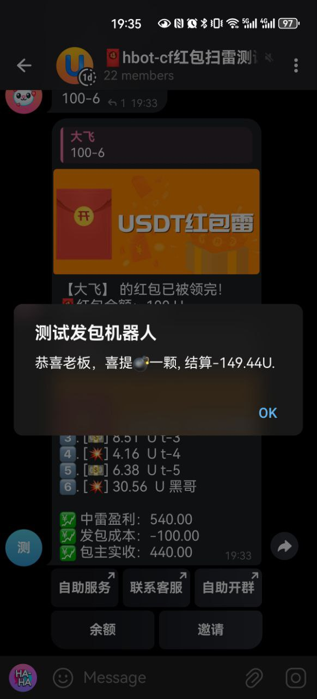
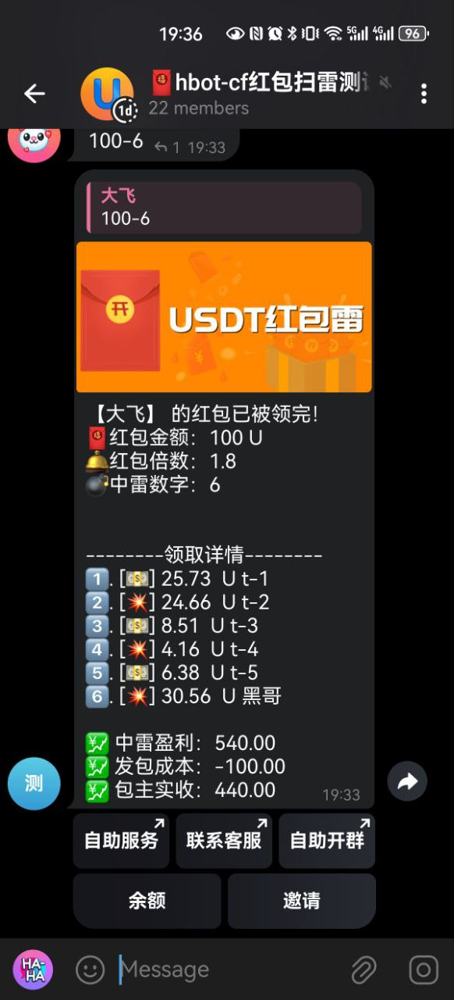

## Telegram红包雷机器人CF版 - Alpha

<p style="text-align: center">
<a href="https://www.gnu.org/licenses/gpl-3.0.html"></a>
<a href="https://github.com/assimon/epusdt/releases/tag/v0.0.1"></a>
</p>


## 项目简介
本项目是基于`cloudflare worker`由`ts`开发的telegram红包雷机器人   
`cloudflare worker`完全免费，所以你并不需要花钱去租用服务器  
本项目遵守 [GPLv3](https://www.gnu.org/licenses/gpl-3.0.html) 开源协议!  

## 功能
- [x] 客服
- [x] 发包
- [x] 抢包
- [x] 结算
- [x] 余额
- [x] 上分
- [ ] 推广
- [ ] 报表
> ## 敬请期待

## 部署教程
```shell
wrangler deploy --keep-vars
```

## 加入交流/意见反馈
- `红包试玩群`[https://t.me/feijige120_hbtest](https://t.me/feijige120_hbtest)
- `电赚电吹俱乐部`交流群组[https://t.me/feijige120_club](https://t.me/feijige120_club)

## 游戏展示



